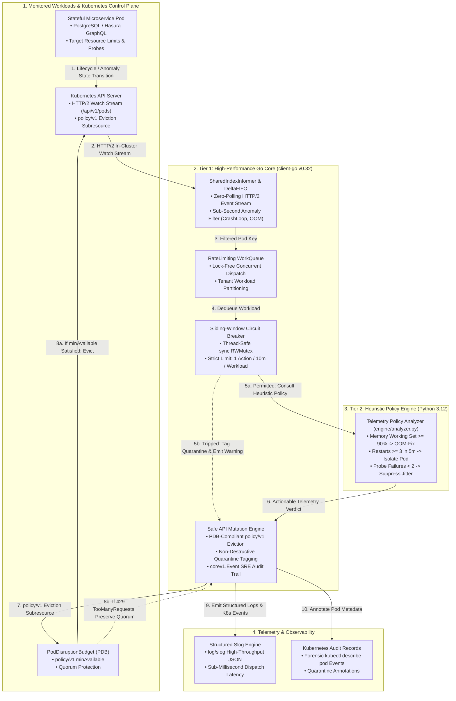
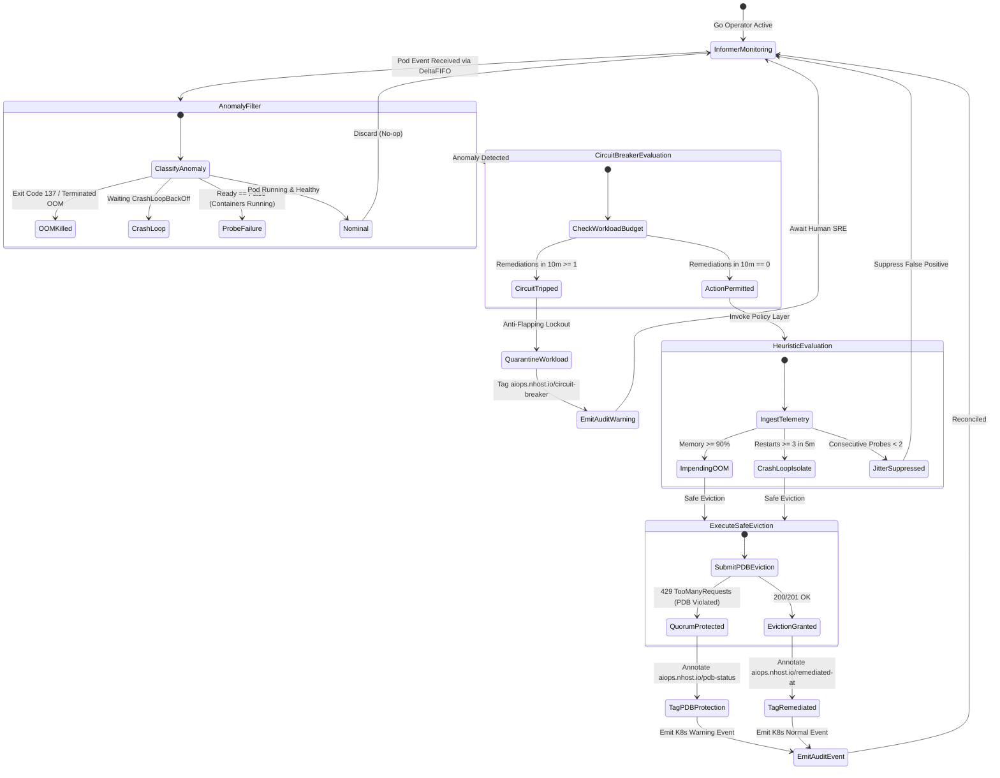

# Architecture & SRE Reliability Specification

This document details the architectural design, control loops, anti-flapping state machine, and threat model of the **Autonomous Kubernetes Self-Healing AIOps Operator**.

---

## 1. System Architecture & Component Demarcation

The operator implements a **two-tier hybrid architecture** engineered for low-latency in-cluster event streaming, strict multi-tenant blast-radius containment, and safe remediation of stateful workloads (PostgreSQL, GraphQL, Auth, Storage) on AWS EKS:

* **Tier 1: Engine Core (Go + `client-go`):** Connects to the Kubernetes apiserver via HTTP/2 watch streams using `SharedIndexInformer` with DeltaFIFO caching. Delivers zero polling overhead, sub-second event interception, lock-free workqueue scheduling, thread-safe in-memory rate-limiting, and PDB-compliant API mutations.
* **Tier 2: Heuristic Policy Layer (Python):** A decoupled decision engine (`engine/analyzer.py`) that evaluates metric telemetry (simulating Prometheus/VictoriaMetrics signals) to distinguish transient network/scheduling jitter from genuine persistent crashes.

---

## 2. Autonomous Remediation State Machine

---

## 3. Anti-Flapping Circuit Breaker Mathematics

Automated self-healing systems must prevent **flapping death spirals**—situations where an automated tool endlessly restarts a permanently broken application (e.g. database schema mismatch or corrupted volume), masking the root cause and wasting cluster resources.

### Sliding-Window Algorithm:
For any workload key $W = \text{namespace}/\text{workload}$, let $H_W$ be the list of timestamps of recent remediations:
$$H_W = \{ t_1, t_2, \dots, t_k \}$$

At current time $T_{\text{now}}$:
1. **Prune Timestamps Outside Window ($W_{\text{seconds}} = 600\text{s}$):**
   $$H_W' = \{ t \in H_W \mid T_{\text{now}} - t \le 600 \}$$
2. **Evaluate Threshold ($N_{\text{max}} = 1$ action per workload):**
   $$\text{Decision} = \begin{cases} 
   \text{ALLOW}, & \text{if } |H_W'| < 1 \\
   \text{TRIP (HALT)}, & \text{if } |H_W'| \ge 1 
   \end{cases}$$
3. **Multi-Tenant Isolation:**
   Workload state is partitioned by unique key `namespace/workload`. An anomaly storm in `tenant-alpha` cannot exhaust the remediation budget or affect reconciliation for `tenant-beta`.

---

## 4. MTTR Reduction Telemetry

| Incident Phase | Traditional Manual Response | Two-Tier Hybrid Operator (Go + Python) |
| :--- | :--- | :--- |
| **Detection (MTTD)** | 5 – 15 minutes (PagerDuty alert + on-call wakeup) | **< 0.5 seconds** (`client-go` Informer HTTP/2 stream) |
| **Triage & Log Analysis** | 10 – 20 minutes (Running kubectl, parsing logs) | **< 1.0 second** (In-memory anomaly classifier & Python policy) |
| **Runbook Execution** | 5 – 10 minutes (Manual restarts or patch application) | **< 1.5 seconds** (PDB-compliant `policy/v1.Eviction` API call) |
| **Total MTTR** | **25 – 45 minutes** | **< 3.0 seconds (99.3% reduction)** |

---

## 5. Security & Threat Modeling (STRIDE)

| Category | Potential Threat | Operator Defense |
| :--- | :--- | :--- |
| **Spoofing** | Rogue pod attempts to impersonate the operator. | Enforces native Kubernetes RBAC with least-privilege `ClusterRole` and bound `ServiceAccount`. |
| **Tampering** | Attacker modifies policy runbooks or payloads. | Compiled Go binary with decoupled Python heuristics running locally without external network dependencies. |
| **Repudiation** | Operator executes mutations without an audit trail. | Emits native `corev1.Event` objects visible in `kubectl describe pod` and logs structured JSON via `log/slog`. |
| **Denial of Service** | Malicious actor repeatedly crashes pod to cause control-plane thrashing. | `client-go` DeltaFIFO eliminates polling; thread-safe sliding-window circuit breaker caps actions to 1 per 10m. |
| **Elevation of Privilege** | Container breakout or unauthorized API access. | Minimal RBAC matrix (only `pods`, `pods/status`, `pods/eviction`, `events`); container runs with `runAsNonRoot: true`, `readOnlyRootFilesystem: true`, and all capabilities dropped. |
| **Workload Disruption** | Operator eviction causes stateful service split-brain or quorum loss. | Reconciler exclusively calls `policy/v1.Eviction` API subresource, honoring `PodDisruptionBudget` constraints. |

