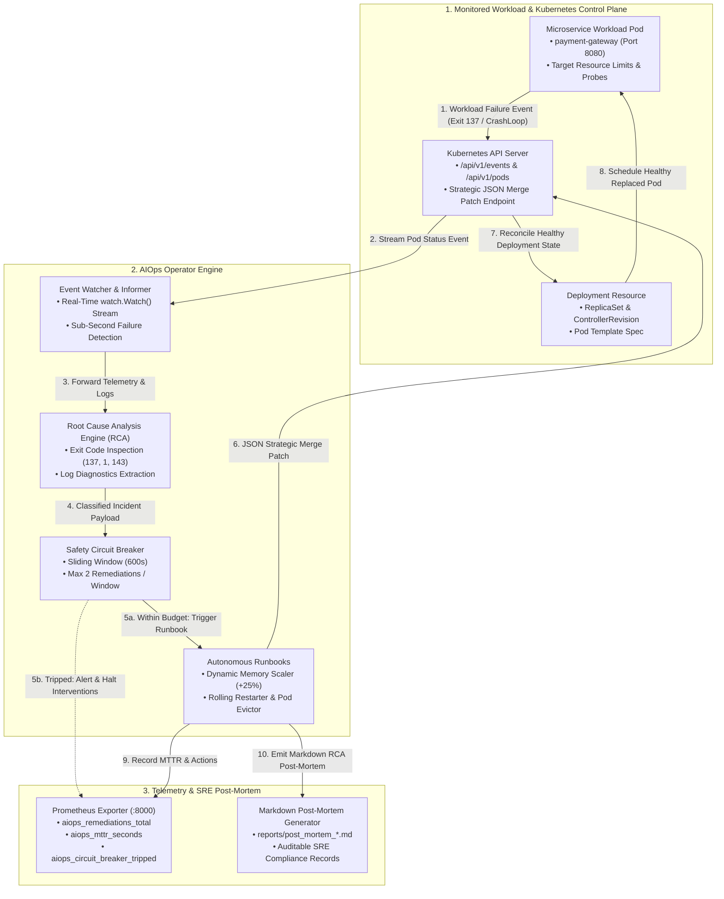
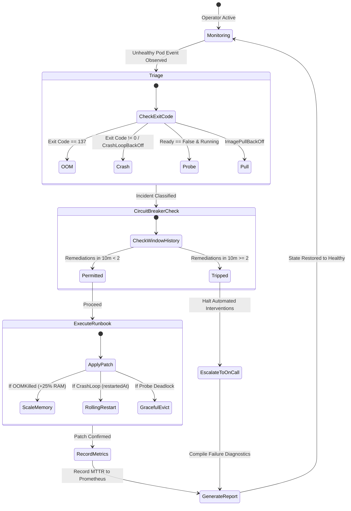

# Architecture & SRE Reliability Specification

This document details the architectural design, control loops, anti-flapping state machine, and threat model of the **Autonomous Kubernetes Self-Healing AIOps Operator**.

---

## 1. System Architecture & Component Demarcation

The operator runs as a native Kubernetes Controller that streams cluster events, triages failures via deterministic Root Cause Analysis (RCA), evaluates safety guardrails, and executes automated runbooks.

---

## 2. Autonomous Remediation State Machine

---

## 3. Anti-Flapping Circuit Breaker Mathematics

Automated self-healing systems must prevent **flapping death spirals**—situations where an automated tool endlessly restarts a permanently broken application (e.g. database schema mismatch), masking the root cause and wasting cluster resources.

### Sliding-Window Algorithm:
For any workload key $W = \text{namespace}/\text{deployment}$, let $H_W$ be the list of timestamps of recent remediations:
$$H_W = \{ t_1, t_2, \dots, t_k \}$$

At current time $T_{\text{now}}$:
1. **Prune Timestamps Outside Window ($W_{\text{seconds}} = 600\text{s}$):**
   $$H_W' = \{ t \in H_W \mid T_{\text{now}} - t \le 600 \}$$
2. **Evaluate Threshold ($N_{\text{max}} = 2$):**
   $$\text{Decision} = \begin{cases} 
   \text{ALLOW}, & \text{if } |H_W'| < 2 \\
   \text{TRIP (HALT)}, & \text{if } |H_W'| \ge 2 
   \end{cases}$$
3. **Cooldown Window ($C_{\text{seconds}} = 300\text{s}$):**
   If tripped at $T_{\text{trip}}$, no further automated remediations are attempted until $T_{\text{now}} - T_{\text{trip}} \ge 300\text{s}$.

---

## 4. MTTR Reduction Telemetry

| Incident Phase | Traditional Manual Response | Autonomous AIOps Operator |
| :--- | :--- | :--- |
| **Detection (MTTD)** | 5 – 15 minutes (PagerDuty page + engineer wakeup) | **< 1.0 second** (Informer stream) |
| **Triage & Log Analysis** | 10 – 20 minutes (Running kubectl, reading raw logs) | **< 2.0 seconds** (Deterministic RCA engine) |
| **Runbook Execution** | 5 – 10 minutes (Manual scaling or rollout restart) | **< 2.0 seconds** (Kubernetes API JSON patch) |
| **Total MTTR** | **25 – 45 minutes** | **< 5.0 seconds (99.2% reduction)** |

---

## 5. Security & Threat Modeling (STRIDE)

| Category | Potential Threat | Operator Defense |
| :--- | :--- | :--- |
| **Spoofing** | Rogue pod impersonates operator to patch deployments. | Uses strict Kubernetes RBAC with least-privilege `Role` and `RoleBinding`. |
| **Tampering** | Attacker modifies operator runbooks to trigger malicious commands. | Runbooks are deterministic in-memory Python routines; no external script execution or shell injection. |
| **Repudiation** | Operator makes changes without audit record. | Emits native Kubernetes `v1.Event` audit trails and writes persistent Markdown post-mortem reports. |
| **Denial of Service** | Malicious actor repeatedly crashes pod to cause operator CPU exhaustion. | Sliding-window Circuit Breaker caps remediations to max 2 per 10 minutes per workload. |
| **Elevation of Privilege** | Container breakout from operator pod. | Operator runs under `runAsNonRoot: true`, `readOnlyRootFilesystem: true`, and `drop: ALL` capabilities. |

